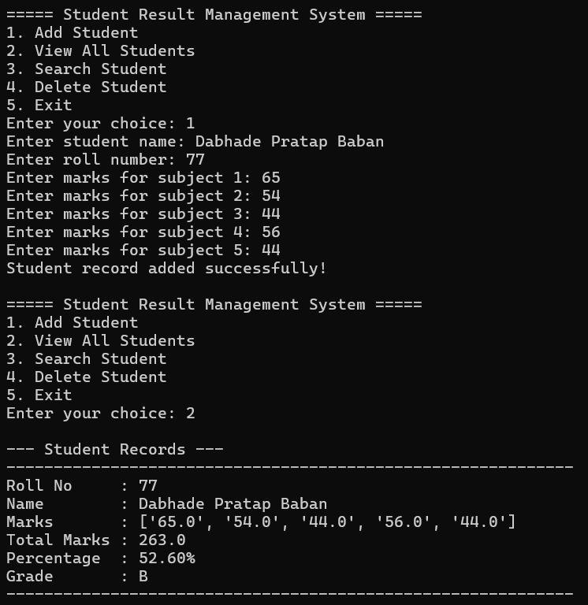

# 🎓 Student Result Management System

## 📌 Project Title
Student Result Management System using Python

---

## 📖 Problem Statement
The Student Result Management System is a Python-based application designed to store, manage, and process student academic records. The system allows users to add, view, search, and delete student records while automatically calculating total marks, percentage, and grade.

This project demonstrates the practical implementation of Python programming concepts such as functions, file handling, conditional statements, loops, and exception handling.

---

## 🚀 Key Features

- Add new student records
- Store student name and roll number
- Enter subject-wise marks (5 subjects)
- Automatic total marks calculation
- Automatic percentage calculation
- Automatic grade generation
- View all student records
- Search student by roll number
- Delete student record
- File handling for data storage
- Menu-driven user interface
- Error handling for invalid inputs

---

## 🛠 Technologies Used

- Python 3
- File Handling (Text File)
- Modular Programming

---

## 🎯 Learning Outcomes

- Understanding Python syntax and control structures
- Implementation of functions and modular programming
- File handling operations
- Error handling and input validation
- Menu-driven application development

## 👨‍💻 Author
Pratap Dabhade 

---

## 🏆Steps to Run the Program

1. Make sure Python is installed on your system.
   (Download from https://www.python.org if not installed)

2. Clone the repository or download the project files.

3. Open Command Prompt / Terminal.

4. Navigate to the project folder:
   cd student-result-management

## Output Screenshot

5. Run the program using:
   python main.py

6. Follow the on-screen instructions to manage student records.

